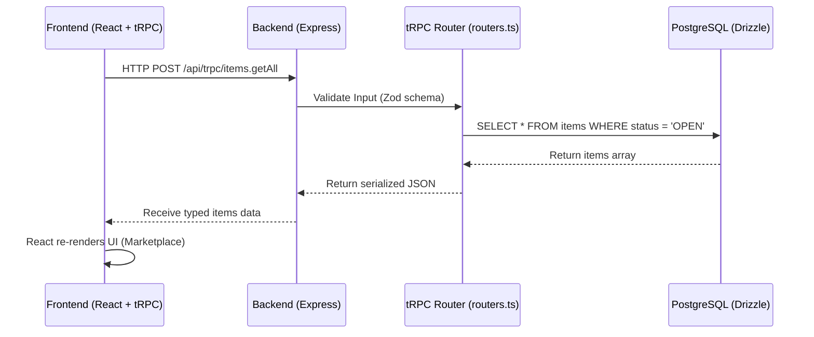

# BorrowBox - System Architecture & Data Flow

## 1. High-Level Architecture

BorrowBox is built as a modern, full-stack TypeScript application utilizing a monolithic architecture. The frontend and backend are tightly integrated using tRPC, which provides end-to-end type safety without the need for manual API schema generation.

### 1.1. Technology Stack

- **Frontend:** React (Vite), Tailwind CSS, shadcn/ui (UI components), Wouter (Routing).
- **Backend:** Node.js, Express, tRPC (API Layer).
- **Database:** PostgreSQL, accessed via Drizzle ORM.
- **Authentication:** Passport.js (Local Strategy) with JWT-like session management.

---

## 2. Data Flow Diagram

---

## 3. Database Schema Overview

The relational database is built around primary entities:

1.  **Users (`users`)**: Stores authentication credentials, profile information, contact numbers, and UPI payment IDs.
2.  **Items (`items`)**: Represents the products being sold/borrowed. Contains titles, prices, descriptions, and a foreign key linking to the `sellerId`.
3.  **Deals (`deals`)**: The transactional bridge between a Buyer and a Seller for a specific Item. Tracks the physical and financial state of a transaction (`status`: OPEN, CONFIRMED, DELIVERED, PAID, CANCELLED).
4.  **Reviews (`reviews`)**: Created after a deal is marked as `PAID`. Links to the reviewer, the reviewee, the specific deal, and contains a 1-5 star rating.
5.  **Admin Actions (`admin_actions`)**: Stores audit trail records (`adminId`, `action`, `targetId`, `timestamp`, `details`) for all administrative actions (bans, unbans, listing deletions, deal cancellations, report status updates).
6.  **Revoked Tokens (`revoked_tokens`)**: Stores SHA-256 hashes of revoked JWT tokens to enforce instant session revocation upon logout.

---

## 4. Key Workflows & Processes

### 4.1. The Authentication Flow

1.  User submits credentials via the Register/Login forms.
2.  Backend validates credentials using Passport.js.
3.  A secure session cookie (`connect.sid`) is generated and returned to the client.
4.  Subsequent tRPC requests automatically include this cookie. The `createContext` function in tRPC extracts the user ID from the session and injects the User object into the context for protected API routes.

### 4.2. The Marketplace Search Flow

1.  As the user types in the search bar, a debounced React state updates.
2.  The `Marketplace` component triggers a `trpc.items.getAll.useQuery` with the `search` string.
3.  Simultaneously, a background autocomplete query fetches the top 5 matches and displays them in a dropdown.
4.  The backend uses a PostgreSQL `ILIKE` query to perform case-insensitive partial matching on item titles.

### 4.3. The Deal & Payment Lifecycle

This is the core business logic of BorrowBox, designed to prevent fraud:

1.  **Initiation:** Buyer clicks "I want this" on an Item. A new `Deal` is created with status `OPEN`.
2.  **Connection:** Buyer is provided a WhatsApp link to message the Seller directly to arrange a meetup.
3.  **Confirmation:** The Seller logs into their Dashboard and marks the deal as `CONFIRMED`.
4.  **Delivery:** Both parties meet physically. The Seller hands over the item and marks the deal as `DELIVERED`.
5.  **Payment Generation:** Once `DELIVERED`, the frontend automatically generates a dynamic UPI QR Code using the Seller's registered UPI ID and the exact item amount.
6.  **Finalization:** The Buyer scans the QR code, completes the payment, and the Seller clicks "Confirm Payment Received", moving the deal to `PAID`.
7.  **Reputation:** Both users are immediately prompted to leave a Star Rating for each other, which recalculates their global "Trust Score".

### 4.4. Content & Listing Moderation Flow

1.  **Image Safety Verification:** Images uploaded during listing creation or updates are analyzed via Google Cloud Vision API for inappropriate content or contraband objects.
2.  **Text Moderation Engine:** Listing titles and descriptions are processed through `server/moderation.ts`.
    - **Leetspeak Decoding:** Translates obfuscated characters (`w33d`, `m@ggi`, `k3ttl3`, `v@pe`).
    - **Repetition & Symbol Normalization:** Collapses character runs (`weeeeed` -> `weed`) and strips non-alphanumeric separators (`w-e-e-d` -> `weed`).
    - **Fuzzy Matching:** Uses Levenshtein edit distance to detect typosquatting and minor spelling variations.
3.  **Mandatory Re-scanning on Update:** `items.update` merges updated text fields with stored item data and re-evaluates both text moderation and image safety on every edit attempt.

