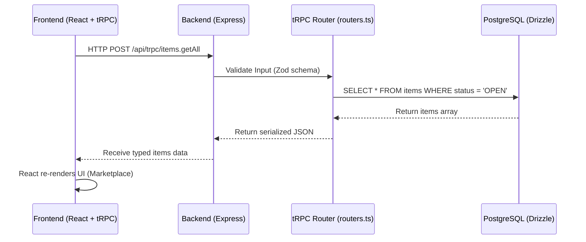

# CampusCart - System Architecture & Data Flow

## 1. High-Level Architecture

CampusCart is built as a modern, full-stack TypeScript application utilizing a monolithic architecture. The frontend and backend are tightly integrated using tRPC, which provides end-to-end type safety without the need for manual API schema generation.

### 1.1. Technology Stack

- **Frontend:** React (Vite), Tailwind CSS, shadcn/ui (UI components), Wouter (Routing).
- **Backend:** Node.js, Express, tRPC (API Layer).
- **Database:** PostgreSQL, accessed via Drizzle ORM.
- **Authentication:** Supabase Auth with server-side session and token verification.

---

## 2. Data Flow Diagram

---

## 3. Database Schema Overview

The relational database is built around primary entities:

1.  **Users (`users`)**: Stores authentication credentials, profile information, contact numbers, and UPI payment IDs.
2.  **Items (`items`)**: Represents the products being sold/borrowed. Contains titles, prices, descriptions, and a foreign key linking to the `sellerId`.
3.  **Deals (`deals`)**: The transactional bridge between a Buyer and a Seller for a specific Item. Tracks the physical and financial state of a transaction (`status`: OPEN, CONFIRMED, DELIVERED, PAID, CANCELLED).
4.  **Reviews (`reviews`)**: Created after a deal is marked as `PAID`. Links to the reviewer, the reviewee, the specific deal, and contains a 1-5 star rating.
5.  **Admin Actions (`admin_actions`)**: Stores audit trail records (`adminId`, `action`, `targetId`, `timestamp`, `details`) for all administrative actions (bans, unbans, listing deletions, deal cancellations, report status updates).
6.  **Revoked Tokens (`revoked_tokens`)**: Stores SHA-256 hashes of revoked JWT tokens to enforce instant session revocation upon logout.
7.  **Item Rejections Queue (`item_rejections`)**: Records flagged/rejected listing attempts (`userId`, `title`, `description`, `imageUrl`, `reason`, `confidenceScores`, `status`). Allows admins to review false positives and override rejections.
8.  **Vision Cache (`image_vision_cache`)**: Caches image SHA-256 hashes to GCV moderation verdicts to prevent redundant Google Cloud Vision API calls and eliminate duplicate billing.

### 3.1. Database Indexing Strategy
To eliminate full table scans on heavily queried dashboard and marketplace endpoints:
- **`deals(buyerId, status)`**: Accelerates buyer dashboard active deal lookups.
- **`deals(sellerId, status)`**: Accelerates seller dashboard active deal lookups.
- **`items(sellerId, status)`**: Accelerates seller active inventory & profile listing queries.
- **`items(category, status, createdAt)`**: Accelerates marketplace category filtering, pagination, and date-based sorting.
- **`item_reports(status)`**: Accelerates admin reports dashboard filtering.

### 3.2. Currency Precision Standard
Currency amounts (`items.amount`, `deals.amount`) are stored exclusively using fixed-point `DECIMAL(10,2)` in PostgreSQL and processed via integer paise arithmetic (`shared/currency.ts`).
- Floating-point representations (`float`/`double`) are strictly prohibited to prevent binary floating-point rounding errors (e.g. `19.990000000000002`).
- All currency calculations perform integer operations in paise (`1 Rupee = 100 Paise`) before serializing back to fixed `DECIMAL(10,2)` strings.

### 3.3. Item Soft-Deletion Lifecycle
Item deletions (by sellers or administrators) perform soft deletion by setting a timestamp in `items.deletedAt`.
- **Foreign Key Integrity:** Preserves relational integrity for `deals`, `reviews`, `messages`, and `item_reports`, ensuring historic transaction receipts and dispute resolution evidence are never broken.
- **Marketplace Filtering:** All public marketplace queries (`getPagedItems`, `getItemsBySellerId`, autocomplete) filter records with `isNull(items.deletedAt)` so soft-deleted items immediately vanish from search and listings.

### 3.4. User Trust Score Synchronization
- **Transactional Review Sync:** When a user receives a review, `createReview` calculates `AVG(rating)` and updates `users.trustScore` atomically within the review insertion transaction.
- **Batch Recompute Job:** `recomputeAllUserTrustScores()` re-evaluates all user ratings against the `reviews` table to eliminate any cached score drift.

### 3.5. Distributed Advisory Lock Scheduler
- **Multi-Instance Scaling:** `runDistributedGuardedCleanupJob()` acquires a session-level PostgreSQL advisory lock (`SELECT pg_try_advisory_lock(99887766)`). In multi-instance deployments behind a load balancer, only one node executes 15-minute cleanup tasks while other instances yield without double-firing.

### 3.6. React Query Cache Tuning
- **Marketplace Browsing (`trpc.items.getAll`):** Configured with `staleTime: 30 * 1000` (30 seconds) to prevent redundant network fetches while navigating.
- **PIN Handshake (`trpc.deals.getById`):** Configured with `staleTime: 0` and active real-time polling `refetchInterval: 3000` (3 seconds) during delivery confirmation and payment processing.

### 3.7. Price Suggestion Engine (Median Sold Prices)
- **Multi-Stage Match Fallback:** `getSuggestedPrice()` queries historical transactions (`items.status = 'SOLD'` or `deals.status = 'PAID'`) using a 3-stage fallback:
  1. Title & Category match
  2. Title match across categories
  3. Category match
- **Median Calculation:** Computes the mathematical median of matching historical sold prices and returns an interactive "Apply ₹[suggestedPrice]" suggestion badge in item creation and editing forms.

---

## 4. Key Workflows & Processes

### 4.1. The Authentication Flow

1.  User submits credentials through the Register/Login forms.
2.  Supabase Auth validates the credentials and manages the authentication session.
3.  The client synchronizes the Supabase access token with the backend.
4.  Subsequent tRPC requests include the authenticated session. The tRPC context verifies the token and injects the user into protected API routes.

### 4.2. The Marketplace Search Flow

1.  As the user types in the search bar, a debounced React state updates.
2.  The `Marketplace` component triggers a `trpc.items.getAll.useQuery` with the `search` string.
3.  **Single-Query Batched Join (N+1 Prevention):** `getPagedItems` performs an `INNER JOIN users ON items.sellerId = users.id`, batching seller identity (`sellerName`, `sellerEmail`, `sellerTrustScore`, `sellerWhatsappVerified`) in a single database roundtrip.
4.  **Search at Scale Roadmap:** Detailed in [`docs/SEARCH_MIGRATION_PLAN.md`](docs/SEARCH_MIGRATION_PLAN.md), covering Meilisearch/Typesense integration, index schemas, dual-write synchronization, and vector search for ML recommendations.

### 4.3. The Deal & Payment Lifecycle

This is the core business logic of CampusCart, designed to prevent fraud:

1.  **Initiation:** Buyer clicks "I want this" on an Item. A new `Deal` is created with status `OPEN`.
2.  **Connection:** Buyer is provided a WhatsApp link to message the Seller directly to arrange a meetup.
3.  **Confirmation:** The Seller logs into their Dashboard and marks the deal as `CONFIRMED`.
4.  **Delivery:** Both parties meet physically. The Seller hands over the item and marks the deal as `DELIVERED`.
5.  **Payment Generation:** Once `DELIVERED`, the frontend automatically generates a dynamic UPI QR Code using the Seller's registered UPI ID and the exact item amount.
6.  **Finalization:** The Buyer scans the QR code, completes the payment, and the Seller clicks "Confirm Payment Received", moving the deal to `PAID`.
7.  **Reputation:** Both users are immediately prompted to leave a Star Rating for each other, which recalculates their global "Trust Score".

### 4.4. Content & Listing Moderation Flow

1.  **GCV Hash Deduplication (Cost Control):** Image buffer SHA-256 hash is checked against in-memory and `image_vision_cache` DB table. Identical image re-uploads return cached verdicts without calling Google Cloud Vision API, preventing redundant billing.
2.  **Image Safety Verification:** On cache miss, images uploaded during listing creation or updates are analyzed via Google Cloud Vision API for inappropriate content or contraband objects. Raw label confidence scores and SafeSearch levels are extracted.
3.  **Text Moderation Engine:** Listing titles and descriptions are processed through `server/moderation.ts`.
    - **Leetspeak Decoding:** Translates obfuscated characters (`w33d`, `m@ggi`, `k3ttl3`, `v@pe`).
    - **Repetition & Symbol Normalization:** Collapses character runs (`weeeeed` -> `weed`) and strips non-alphanumeric separators (`w-e-e-d` -> `weed`).
    - **Fuzzy Matching:** Uses Levenshtein edit distance to detect typosquatting and minor spelling variations.
4.  **Rejection Review Queue & Admin Overrides:** Rejected items (e.g. false positives on legitimate items like chemistry kits, lab coats, grafters) are automatically routed to `item_rejections` with raw GCV confidence scores. Admins can inspect the Rejections Queue on the Admin Dashboard and click **Approve Listing** to publish the item directly.
5.  **Mandatory Re-scanning on Update:** `items.update` merges updated text fields with stored item data and re-evaluates both text moderation and image safety on every edit attempt.

