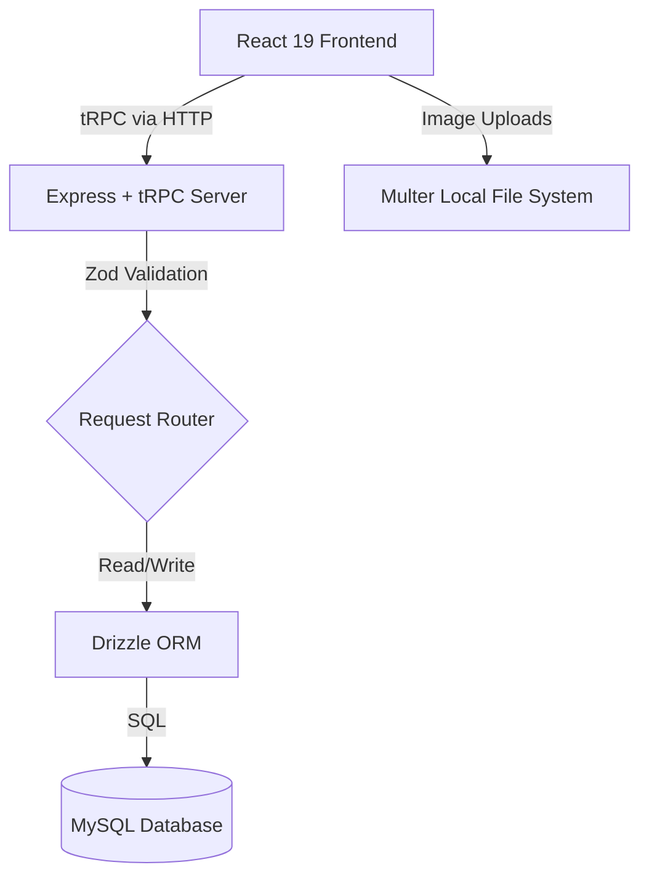
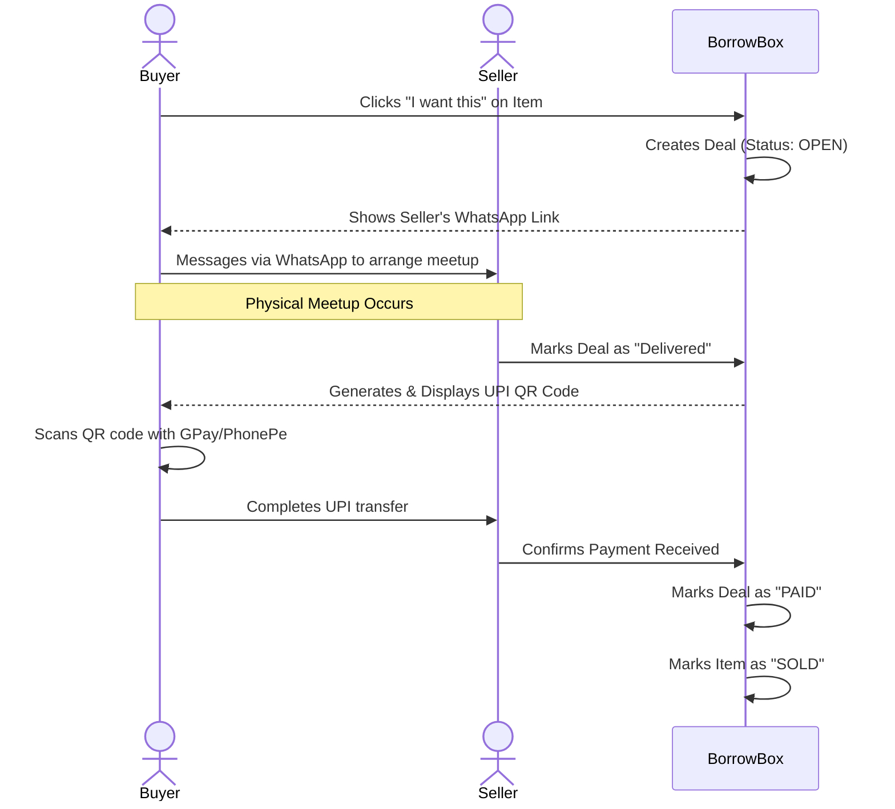

# Product Requirements Document (PRD): BorrowBox

**Product:** BorrowBox  
**Tagline:** Borrow. Share. Repeat.  
**Type:** Peer-to-peer college marketplace web application  
**Date:** June 2026

---

## 1. Executive Summary

BorrowBox is a specialized, localized peer-to-peer marketplace designed specifically for college and university students. It solves the problem of underutilized assets on campus by allowing students to buy, sell, or rent items securely. Built on a modern React/tRPC stack, the platform prioritizes fast communication via WhatsApp deep-linking and secure transactions using a strictly governed delivery confirmation flow and dynamic UPI QR code generation.

## 2. Problem Statement

College students frequently need items for short durations (e.g., textbooks, lab equipment, mini-fridges) or want to sell items quickly at the end of a semester. Traditional marketplaces (Craigslist, Facebook Marketplace) are plagued by spam, require long-distance logistics, lack built-in trust mechanisms for the campus demographic, and are often clunky to use. There is no centralized, trusted, fast-paced marketplace tailored to the unique financial and logistical constraints of college students.

## 3. Target Users and Personas

| Persona                    | Description                                                   | Goals                                                                                  | Pain Points                                       |
| :------------------------- | :------------------------------------------------------------ | :------------------------------------------------------------------------------------- | :------------------------------------------------ |
| **"The Saver" (Buyer)**    | Freshman/Sophomore looking for cheap textbooks and dorm gear. | Wants to find items quickly, verify the seller is real, and pay securely upon meeting. | Afraid of getting scammed online; limited budget. |
| **"The Hustler" (Seller)** | Junior/Senior moving out or trying to make extra cash.        | Wants to list items rapidly and connect with buyers without the hassle of shipping.    | Frustrated by flaky buyers and negotiating fees.  |

## 4. Goals and Success Metrics

### Business Goals

1. Establish a high-liquidity marketplace within the campus ecosystem.
2. Minimize transaction friction and eliminate pre-payment fraud.

### Success Metrics (KPIs)

- **Liquidity Rate:** > 40% of listed items receive a "Deal" request within 7 days.
- **Conversion Rate:** > 75% of OPEN deals successfully reach the PAID status.
- **Time to Meet:** Average time from "Contacted" to "DELIVERED" is under 48 hours.
- **User Retention:** > 30% of buyers become sellers (and vice versa) within 3 months.

## 5. Scope

### In-Scope

- Email/password user authentication with session management.
- Item listings creation with a single image, title, description, price, and category.
- Marketplace discovery with search autocomplete and category filtering.
- Buyer-to-Seller connections via WhatsApp (`wa.me` deep links).
- A 4-step Deal lifecycle (`OPEN` → `Contacted` → `Shipped/DELIVERED` → `PAID`).
- Dynamic UPI QR code generation post-delivery for secure payments.
- Seller dashboard for item and deal tracking.

### Out-of-Scope (for Current Version)

- Fully automated, server-side UPI payment verification (callbacks).
- Cloud image storage (e.g., AWS S3).
- In-app WebSocket chat/messaging.
- Multi-image uploads per item.
- Automated push or email notifications.
- Escrow payment integration.

## 6. User Stories

- **As a Seller**, I want to list my textbook with a photo and price so that I can sell it to someone on campus.
- **As a Buyer**, I want to search for "calculators" and filter by category so that I can find exactly what I need for my exam.
- **As a Buyer**, I want to click a button to immediately WhatsApp the seller so that we can arrange a campus meetup quickly.
- **As a Seller**, I want the app to generate a UPI QR code for the exact amount only _after_ I physically hand over the item so that the buyer can pay me securely without disputes.
- **As a User**, I want to view my dashboard so that I can track which items I am selling and the status of my ongoing deals.

## 7. Functional Requirements

### 7.1. Authentication

- **Req-1.1:** System shall allow users to register with an email and password.
- **Req-1.2:** Passwords must be hashed using `bcryptjs` before database insertion.
- **Req-1.3:** System shall generate a JWT session token stored as an HTTP-only cookie upon successful login/registration.

### 7.2. Profile Management

- **Req-2.1:** Users shall be able to input and save their WhatsApp Number, UPI ID, and UPI Name.
- **Req-2.2:** WhatsApp numbers must be normalized to enable `wa.me` deep linking.

### 7.3. Marketplace & Search

- **Req-3.1:** System shall display a grid of all available (`OPEN`) items.
- **Req-3.2:** System shall provide category filters (e.g., Books, Electronics, Furniture).
- **Req-3.3:** Client-side search and autocomplete must filter items dynamically by title/category as the user types.

### 7.4. Listing Creation

- **Req-4.1:** Sellers shall be able to upload a single image (stored locally via Multer).
- **Req-4.2:** Sellers shall provide title, description, price, and category.

### 7.5. Deal Management & Payment

- **Req-5.1:** Buyers shall be able to click "I want this" to generate a `Deal` linked to the item.
- **Req-5.2:** The deal status shall progress through: `OPEN` -> `Contacted` -> `Shipped` (Delivered) -> `PAID`.
- **Req-5.3:** The system shall restrict UPI QR code generation (format: `upi://pay?pa={UPI_ID}&pn={UPI_NAME}&am={PRICE}`) until the seller manually advances the deal status to `DELIVERED` (`Shipped`).

## 8. Non-Functional Requirements

- **Performance:** Marketplace grid must load within 1 second. Autocomplete suggestions must render in < 200ms.
- **Security:** JWT cookies must be `HTTPOnly` and `Secure`. Input validation must be strictly enforced using `Zod` on all tRPC endpoints.
- **Scalability:** The architecture must cleanly separate the API layer (tRPC) from the database layer (Drizzle ORM) to allow easy migration from SQLite/Local DB to a managed MySQL instance.

## 9. Technical Architecture Overview

**Tech Stack:**

- **Frontend:** React 19, TypeScript, Vite 7, TailwindCSS 4, Wouter, tRPC client, TanStack React Query, shadcn/ui.
- **Backend:** Node.js, Express.js, tRPC server.
- **Database:** MySQL via Drizzle ORM.
- **Auth/Security:** `bcryptjs`, `jsonwebtoken`, Zod, Multer.

## 10. Database Schema

| Table   | Primary Key | Key Columns                                                                | Relationships                                                             |
| :------ | :---------- | :------------------------------------------------------------------------- | :------------------------------------------------------------------------ |
| `users` | `id`        | `email`, `password` (hashed), `name`, `whatsappNumber`, `upiId`, `upiName` | -                                                                         |
| `items` | `id`        | `title`, `description`, `price`, `imageUrl`, `category`, `status`          | `sellerId` -> `users.id`                                                  |
| `deals` | `id`        | `status` (OPEN, DELIVERED, PAID), `amount`                                 | `buyerId` -> `users.id`, `sellerId` -> `users.id`, `itemId` -> `items.id` |

## 11. User Flows

### Marketplace Deal Flow

## 12. UI/UX Requirements

- **Theme:** Dark Mode by default for a premium, sleek aesthetic. Vibrant accents for primary actions.
- **Responsiveness:** Mobile-first design, specifically optimizing the Item Details and QR Code scanner views for mobile phones (since meetups occur on the go).
- **Components:** Standardized design language using `shadcn/ui` and `Radix UI` primitives.

## 13. API Endpoints (tRPC Surface)

_(Note: tRPC abstracts traditional REST endpoints into strongly-typed procedure calls)_

- **`auth.login` / `auth.register` / `auth.logout` / `auth.me`**
- **`items.getAll`**: Fetches marketplace grid with search/category arguments.
- **`items.getById`**: Fetches single item.
- **`items.create`**: Requires `FormData` (via standard Express route) due to Multer file constraints, then uses tRPC for metadata.
- **`deals.create`**: Initializes a deal.
- **`deals.updateStatus`**: Transitions deal states.
- **`deals.getByUser`**: Populates the Seller/Buyer dashboards.

## 14. Security Considerations

- **No Direct Contact Info Leakage:** WhatsApp links and UPI IDs are only exposed _after_ a deal is initiated and only to the specific counterparty involved in the deal.
- **XSS/CSRF Prevention:** React strictly escapes UI output. JWT tokens are locked inside `HTTPOnly` cookies, nullifying local storage XSS theft.
- **File Upload Vulnerabilities:** Multer must enforce `.png`, `.jpg`, `.jpeg` extensions and limit file sizes to < 5MB to prevent storage exhaustion or malicious file execution.

## 15. Known Limitations and Risks

- **No Automated Payment Verification:** Because we rely on standard UPI QR codes without a merchant API gateway, the platform inherently relies on the Seller clicking "Payment Received". Risk: A buyer shows a fake payment screenshot to a naive seller.
- **Local Disk Image Storage:** Local Multer storage will break horizontally scaled server environments (e.g., Kubernetes or multi-instance deployments).
- **Client-Side Search:** As the item table grows into the tens of thousands, client-side autocomplete will degrade in performance.

## 16. Future Roadmap

| Phase       | Milestone / Features                                                                                                                            |
| :---------- | :---------------------------------------------------------------------------------------------------------------------------------------------- |
| **Phase 1** | Current MVP (Auth, Listings, WhatsApp deep-links, UPI QR gen).                                                                                  |
| **Phase 2** | **Trust & Scale:** Rating/Review system, College `.edu` email verification, Server-side full-text search.                                       |
| **Phase 3** | **Infrastructure:** Migrate images to Cloud Storage (AWS S3), Implement push/email notifications for deal updates.                              |
| **Phase 4** | **Platform Maturation:** Multi-image uploads, In-app WebSockets messaging (deprecating WhatsApp reliance), Campus-scoped marketplace instances. |

## 17. Open Questions

1. **Dispute Resolution:** What is the protocol if a seller marks an item as "Delivered" but the buyer refuses to pay? Since we do not hold funds in Escrow, do we simply ban the buyer?
2. **Monetization:** Will BorrowBox eventually charge a small convenience fee on successful transactions? If so, we must integrate a payment gateway (like Razorpay) rather than relying on direct P2P UPI QR codes.
3. **Old Data:** How long do we keep "SOLD" items visible on the marketplace before archiving them to save database queries?
